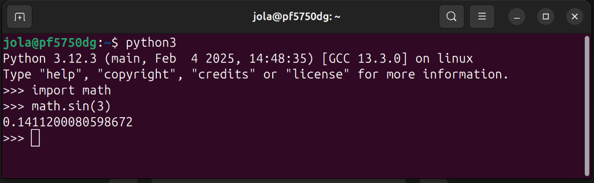
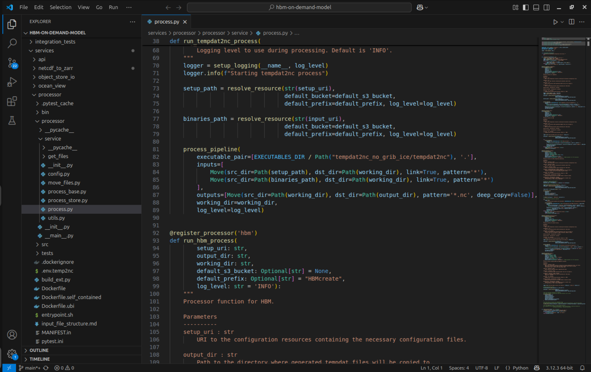
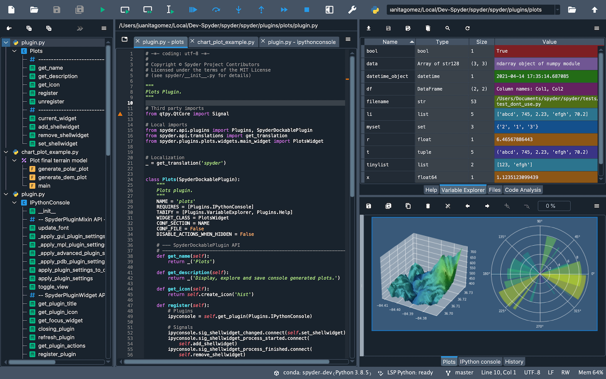
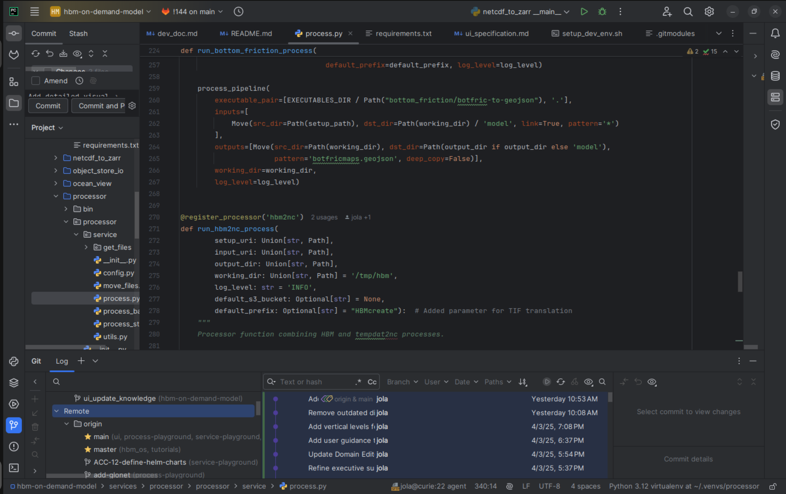
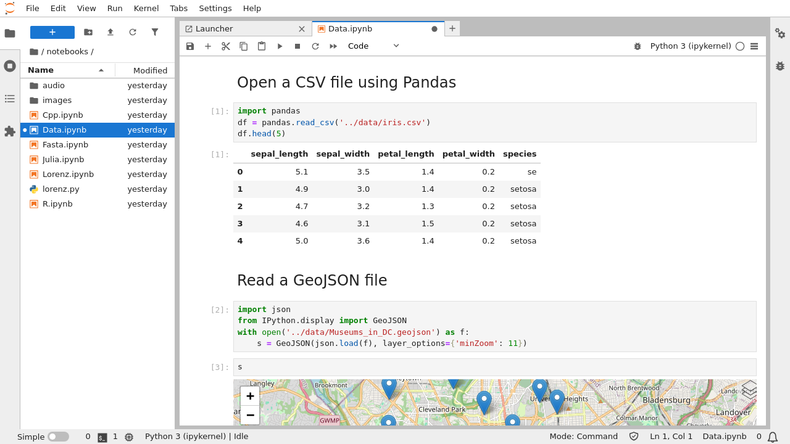
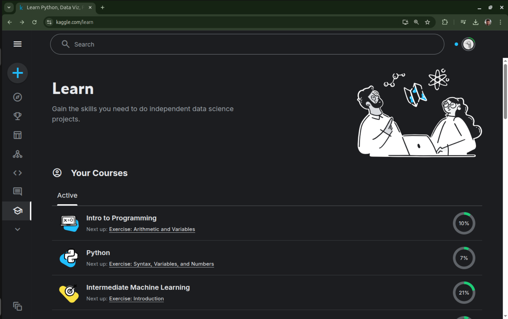
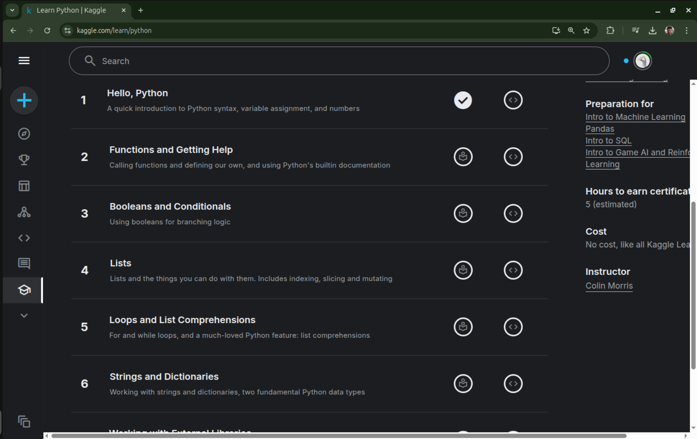
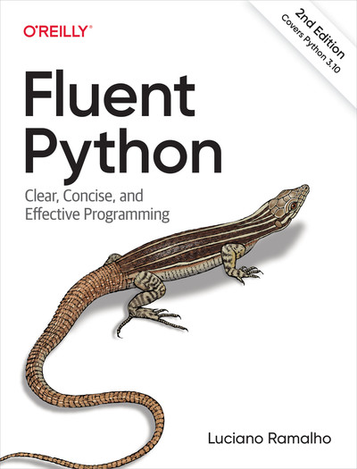
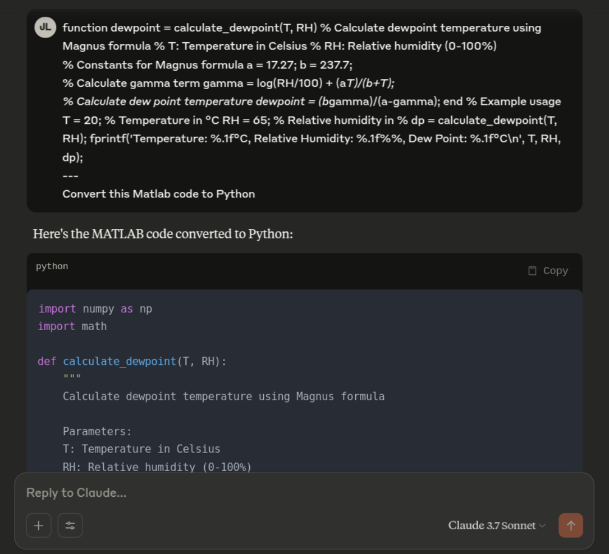

<!---
Note for converting to HTML

Create scrollable chat-like window in the presentation where there is too much text to fit in the slide by:

1. Using a div container with specific CSS properties:
   ```html
   <div style="background-color: #f9f9f9; border: 1px solid #ddd; 
               padding: 20px; height: 70vh; overflow-y: auto;">
   ```

2. The key properties that enable scrolling are:
   - `height: 70vh` - Makes it take up 70% of the screen height
   - `overflow-y: auto` - Creates a scrollbar when content exceeds this height

3. The styling (background color, border, padding) gives it a distinct chat window appearance within the slide.

This approach keeps all LLM content in a single slide while allowing the audience to scroll through it.
--->

## Pathways to Learn Python for Scientific Software Development

### A Guide for Researchers at DMI

* **Presenter:** [Your Name/Department]
* **Date:** April 7, 2025
* *(Optional: Add DMI Logo)*

Note: This talk outlines practical learning paths, resources, tools, and best practices for researchers at DMI looking to start or improve their skills in scientific software development using Python.

---

Python is a *dynamic* language, meaning you can open it in the terminal and use it interactively.



... as opposed to a *compiled* language like Fortran.

---

## Development Environments

You can develop using your favourite text editor, VIM, etc., but there are benefits in using an IDE:

* **Code Completion**: Suggests function names, parameters, and imports as you type
* **Integrated Debugging**: Set breakpoints, inspect variables, and step through code execution
* **Version Control Integration**: Git support built directly into your development environment
* **Virtual Environment Management**: Create and manage Python environments with ease
* **Scientific Tooling**: Built-in support for Jupyter notebooks, data visualization, and scientific libraries
* **Code Inspection**: Automated detection of style issues, errors, and potential bugs

---

## Visual Studio Code



Very popular, but requires some setup: [https://code.visualstudio.com/docs/languages/python](https://code.visualstudio.com/docs/languages/python)

---

## Spyder



Matlab like interface, but more limited.

---

## PyCharm



Sophisticated, Python orientated IDE. Requires a subscription.

---

## Jupyter Lab



For interactive code development. Not suitable for large code bases.

---

## Learn the basic syntax: tutorial

[The official Python tutorial](https://docs.python.org/3/tutorial/index.html)


---

https://www.pythoncheatsheet.org/cheatsheet

---

## Learn the basic syntax: Kaggle




Kaggle offers course on Python...

---

## Learn the basic syntax: tutorial



Kaggle offers course on Python...

---

## Key Python Libraries for Scientific Software
### Domain-Specific Libraries

* **[Cartopy](https://scitools.org.uk/cartopy/docs/latest/getting_started/index.html)** - Geospatial data processing
* **[scikit-learn](https://scikit-learn.org/stable/index.html)** - Machine learning
* **[PyTorch](https://pytorch.org/)** - Deep learning

### Scientific Computing
* **Dask** - Parallel computing
* **xarray / zarr** 
* **Numba** - JIT compiler for accelerating code
* **JAX** - High-performance numerical computing

---



---

## Use a LLM: Convert from Matlab to Python


An example using Claude

---

## Clean Code Principles
### Pythonic Practices

* **PEP 8** - Python's style guide
* **Descriptive naming** - Variables and functions should be self-explanatory
* **List comprehensions** over explicit loops when appropriate
* **Context managers** for resource handling (with statements)
* **Type hints** for improved readability and IDE support
* **Error handling** - Explicit exception handling with appropriate scope

---

# Ask a LLM

## Is this *clean code*?

Give your code to a LLM (Large Language Model). 
It will evaluate the code and show you how to improve it.

---

<!-- Note to LLM: Please embed this text in separate page the window -->

Prompt: I have a time series of 3D air pressure measurements. Please demonstrate how I can effeciently anlyse the data using xarray.

Response:

I'd be happy to demonstrate how to efficiently analyze 3D air pressure measurements using xarray, which is an excellent library for working with labeled multi-dimensional arrays, particularly for atmospheric data.

Let me create a comprehensive example showing how to work with your 3D air pressure data using xarray:

# Analyzing 3D Air Pressure Data with xarray

Xarray is an excellent tool for working with multi-dimensional labeled arrays, particularly atmospheric data like your 3D air pressure measurements. Here's how you can efficiently analyze such data:

## Key Benefits of Using xarray

1. **Labeled dimensions** - xarray uses named dimensions and coordinates, making data access intuitive
2. **NetCDF compatibility** - seamless reading/writing of NetCDF files (standard format for climate data)
3. **Built-in operations** - powerful aggregation, selection, and computation methods
4. **Integration with other tools** - works well with pandas, numpy, dask, and visualization libraries

## Typical Workflow

### 1. Data Loading and Inspection

```python
import xarray as xr
import numpy as np
import matplotlib.pyplot as plt

# Load data from a NetCDF file
ds = xr.open_dataset('pressure_data.nc')

# Examine dataset structure
print(ds)
print(ds.info())

# Check for missing values
print(ds.isnull().sum())
```

### 2. Selection and Subsetting

```python
# Select a specific time
time_slice = ds.sel(time='2023-01-10')

# Select a pressure level
level_500 = ds.sel(level=500)  # 500 hPa

# Select a geographic region
region = ds.sel(lat=slice(30, 60), lon=slice(280, 360))
```

### 3. Aggregation and Analysis

```python
# Temporal means
monthly_mean = ds.pressure.resample(time='M').mean()

# Spatial means
zonal_mean = ds.pressure.mean(dim='lon')  # Average along longitude
meridional_mean = ds.pressure.mean(dim='lat')  # Average along latitude

# Vertical profile
vertical_profile = ds.pressure.mean(dim=['lat', 'lon'])

# Calculate anomalies
climatology = ds.pressure.mean(dim='time')
anomalies = ds.pressure - climatology
```

### 4. Visualization

```python
# Plot a horizontal slice
level_500.pressure.isel(time=0).plot(
    figsize=(12, 8),
    cmap='viridis'
)

# Plot a vertical cross-section
ds.pressure.isel(time=0).sel(lat=0).plot(
    y='level',
    figsize=(12, 6)
)

# Create a time series for a point
ds.pressure.sel(lat=45, lon=280, level=500, method='nearest').plot()
```

### 5. Advanced Analysis

```python
# Calculating gradients
pressure_gradient_x = ds.pressure.differentiate(coord='lon')
pressure_gradient_y = ds.pressure.differentiate(coord='lat')

# Coarsen data (reduce resolution)
coarse_data = ds.coarsen(lat=2, lon=2).mean()

# Apply computation across multiple dimensions
result = xr.apply_ufunc(
    your_function,
    ds.pressure,
    input_core_dims=[['time', 'level', 'lat', 'lon']],
    output_core_dims=[['lat', 'lon']],
    vectorize=True
)
```

The artifact I've provided includes a comprehensive example that:
1. Creates a synthetic dataset (or shows how to load a real one)
2. Performs basic data exploration
3. Demonstrates various selection, aggregation, and analysis techniques
4. Creates multiple visualizations (horizontal slices, vertical cross-sections, time series)
5. Shows advanced analysis methods (EOF analysis, trend analysis, seasonal patterns)
6. Demonstrates data export options

Would you like me to explain any particular aspect of the code in more detail?

---


