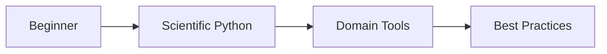

# Pathways to Learn Python for Scientific Software Development

**A Comprehensive Guide for DMI Researchers**

<div class="pt-12">
  <span @click="$slidev.nav.next" class="px-2 py-1 rounded cursor-pointer" hover="bg-white bg-opacity-10">
    Press Space to start <carbon:arrow-right class="inline"/>
  </span>
</div>

---
transition: fade-out
---

# Why This Learning Path?

<div class="grid grid-cols-2 gap-8">
<div>

## The Challenge

- Python ecosystem is **vast**
- Scientific computing needs
- Quality matters in research
- Time is precious

</div>
<div>

## Our Approach

- Curated pathways by level
- Focus on meteorology & oceanography
- Modern best practices

</div>
</div>

---

# Learning Path 

<div class="text-center mb-8">



</div>

<div class="grid grid-cols-3 gap-4 text-sm">
<div>

## Phase 1: Foundations
- Python syntax & concepts
- Basic data structures
- Simple scripts

</div>
<div>

## Phase 2: Scientific Stack
- NumPy, Pandas, Xarray
- Plotting with Matplotlib
- Jupyter workflows

</div>
<div>

## Phase 3: Advanced
- Clean code principles
- Version control
- Testing & debugging

</div>
</div>

---
layout: section
---

# Part 1: Getting Started
## Choosing Your First Steps


---

# Learning Paths by Background

## Complete Beginner

**Start Here:**
* **<a href="https://docs.python.org/3/tutorial/" style="color: #0066cc;">Python.org Tutorial</a>** - Official guide
* **<a href="https://swcarpentry.github.io/python-novice-inflammation/" style="color: #0066cc;">Software Carpentry</a>** - Research-focused workshops
* **<a href="https://nostarch.com/python-crash-course-3rd-edition" style="color: #0066cc;">Python Crash Course (3rd Edition)</a>** - Comprehensive with projects
* **<a href="https://ida.dk/arrangementer-og-kurser/kurser/it-udvikling/laer-at-programmere-i-python" style="color: #0066cc;">Lær at programmere i Python</a>** - IDA's Python Course

**Time:** 4-6 weeks (1-2 hrs/day)

---

# Coming from MATLAB/R/Fortran

**Start Here:**
1. **<a href="https://numpy.org/doc/stable/user/numpy-for-matlab-users.html" style="color: #0066cc;">NumPy for MATLAB users</a>** - Direct translation guide
2. **<a href="https://projectpythia.org/" style="color: #0066cc;">Project Pythia</a>** - Earth sciences focus
3. **<a href="https://wesmckinney.com/book/" style="color: #0066cc;">Python for Data Analysis (3rd Ed)</a>** - By pandas creator

**Time:** 2-3 weeks (1-2 hrs/day)

**First Project:** Port existing analysis

**Next Book:** <a href="https://www.oreilly.com/library/view/fluent-python-2nd/9781492056348/" style="color: #0066cc;">Fluent Python</a> for Python mastery

---

# Modern Learning Resources Comparison

| Resource | Best For | Format | Time | Cost | 
|----------|----------|---------|------|------|
| **<a href="https://swcarpentry.github.io/python-novice-inflammation/" style="color: #0066cc;">Software Carpentry</a>** | Research beginners | Workshop-style | 2 days | Free |
| **<a href="https://projectpythia.org/" style="color: #0066cc;">Project Pythia</a>** | Atmospheric scientists | Tutorials + Videos | Self-paced | Free | 
| **<a href="https://realpython.com/" style="color: #0066cc;">Real Python</a>** | All levels | Articles + Courses | Ongoing | Free/Paid |
| **<a href="https://www.codecademy.com/learn/learn-python-3" style="color: #0066cc;">Codecademy Python</a>** | Absolute beginners | Interactive | 25 hours | Free/Pro |
| **<a href="https://www.coursera.org/specializations/python" style="color: #0066cc;">Python for Everybody</a>** | General programming | Video lectures | 8 months | Free/Paid |

<div class="mt-8 p-4 bg-green-100 bg-opacity-10 rounded-lg">
  <strong>Recommendation:</strong> Start with Software Carpentry + Project Pythia for the perfect research focus
</div>

---
layout: section
---

# Part 2: Scientific & Domain Tools
## Building Your Technical Stack


---

# Essential Scientific Stack: Data Handling


<div class="grid grid-cols-2 gap-8">
<div>

```python
import numpy as np
import pandas as pd
import xarray as xr
```

</div>
<div>

**Core Libraries:**
* **NumPy**: Efficient array computing and mathematical operations
* **Pandas**: Tabular data analysis with DataFrames  
* **Xarray**: Labeled multi-dimensional arrays for NetCDF/climate data

</div>
</div>

<div class="flex gap-6 justify-center mt-6">
  <a href="https://numpy.org/doc/stable/user/absolute_beginners.html" style="color: #0066cc; padding: 8px 16px; border: 1px solid #0066cc; border-radius: 4px;">NumPy Guide</a>
  <a href="https://pandas.pydata.org/docs/user_guide/10min.html" style="color: #0066cc; padding: 8px 16px; border: 1px solid #0066cc; border-radius: 4px;">Pandas Tutorial</a>
  <a href="https://docs.xarray.dev/en/stable/getting-started-guide/quick-overview.html" style="color: #0066cc; padding: 8px 16px; border: 1px solid #0066cc; border-radius: 4px;">Xarray Intro</a>
</div>

**Learning Order:** NumPy (1 week) → Pandas (1 week) → Xarray (2 weeks) → Domain tools

---

# Essential Scientific Stack: Visualization Tools


<div class="grid grid-cols-2 gap-8">
<div>

```python
import matplotlib.pyplot as plt
import cartopy.crs as ccrs
import holoviews as hv
```

</div>
<div>

**Core Libraries:**
* **Matplotlib**: Foundation plotting library for static graphs
* **Cartopy**: Map projections and geospatial plotting
* **HoloViews**: High-level data visualization with interactivity

</div>
</div>

<div class="flex gap-6 justify-center mt-6">
  <a href="https://matplotlib.org/stable/tutorials/index.html" style="color: #0066cc; padding: 8px 16px; border: 1px solid #0066cc; border-radius: 4px;">Matplotlib</a>
  <a href="https://scitools.org.uk/cartopy/docs/latest/gallery/index.html" style="color: #0066cc; padding: 8px 16px; border: 1px solid #0066cc; border-radius: 4px;">Cartopy</a>
  <a href="https://holoviews.org/getting_started/Introduction.html" style="color: #0066cc; padding: 8px 16px; border: 1px solid #0066cc; border-radius: 4px;">HoloViews</a>
</div>

---

# Scientific Stack: Domain-Specific Tools


<div class="grid grid-cols-2 gap-8">
<div>

```python
# Atmosphere
import metpy
import satpy
# Ocean  
import xarray
import gsw  # oceanography
```

</div>
<div>

**Core Libraries:**
* **MetPy**: Meteorological calculations and weather analysis
* **Satpy**: Reading and processing satellite data
* **GSW**: Oceanographic thermodynamics (TEOS-10)
* **xgcm**: Grid-aware operations for ocean/atmosphere models

</div>
</div>

<div class="flex gap-6 justify-center mt-6">
  <a href="https://unidata.github.io/MetPy/latest/tutorials/index.html" style="color: #0066cc; padding: 8px 16px; border: 1px solid #0066cc; border-radius: 4px;">MetPy</a>
  <a href="https://teos-10.github.io/GSW-Python/" style="color: #0066cc; padding: 8px 16px; border: 1px solid #0066cc; border-radius: 4px;">GSW</a>
  <a href="https://xgcm.readthedocs.io/" style="color: #0066cc; padding: 8px 16px; border: 1px solid #0066cc; border-radius: 4px;">xgcm</a>
</div>


---

# Weather & Climate Data Access

## Atmosphere/Land Data

**<a href="https://github.com/ecmwf/ecmwf-opendata" style="color: #0066cc;">ECMWF Open Data</a>**
```python
from ecmwf.opendata import Client
client = Client()
# Real-time forecasts
```
Access real-time ECMWF weather forecasts from high-resolution and ensemble models

**<a href="https://cds.climate.copernicus.eu/datasets/reanalysis-era5-single-levels" style="color: #0066cc;">ERA5 Reanalysis</a>**
```python
import cdsapi
c = cdsapi.Client()
# Historical weather
```
Comprehensive atmospheric reanalysis from 1940-present with hourly data

<a href="https://cds.climate.copernicus.eu/how-to-api" style="color: #0066cc;">CDS setup</a>

---

# Ocean & Marine Data

**<a href="https://marine.copernicus.eu/" style="color: #0066cc;">Copernicus Marine Service</a>**
```python
import copernicusmarine as cm
cm.open_dataset(
    dataset_id="cmems_mod_glo_phy_anfc_0.083deg_P1D-m"
)
```
Ocean observations, analyses, forecasts, and reanalyses for European seas and global ocean

**Additional Ocean/Climate Datasets via CDS:**
- Sea ice concentration and thickness
- Sea surface temperature (SST) 
- Ocean heat content and sea level
- CMIP6 climate projections

<a href="https://pypi.org/project/copernicus-marine-client/" style="color: #0066cc;">Marine Python Client</a> • <a href="https://help.marine.copernicus.eu/en/articles/7970514-copernicus-marine-toolbox-introduction" style="color: #0066cc;">Documentation</a>

---

# Satellite Data

**<a href="https://satpy.readthedocs.io/" style="color: #0066cc;">Satpy</a>** (Multi-sensor)
```python
from satpy import Scene
scn = Scene(filenames=files)
scn.load(['natural_color'])
```
Python library for reading and processing earth-observing satellite data

**<a href="https://user.eumetsat.int/resources/user-guides/eumetsat-data-access-client-eumdac-guide" style="color: #0066cc;">EUMDAC</a>**
```python
import eumdac
```
Access EUMETSAT's entire satellite data archive programmatically

**Setup:** 
 * `conda install -c conda-forge satpy xarray cfgrib`
 * `uv pip install copernicusmarine`

----


<div class="flex items-center justify-center h-full text-center">
Ask your colleagues what libraries they use for your domain.
</div>

---
layout: section
---

# Part 3: Development Environment


---

# IDE Choice

<div class="grid grid-cols-2 gap-8">
<div>

## Recommended: 
**<a href="https://code.visualstudio.com/" style="color: #0066cc;">VS Code</a>**
- Free, lightweight
- <a href="https://marketplace.visualstudio.com/items?itemName=ms-python.python" style="color: #0066cc;">Good Python extension</a>
- Can be used for other languages
- Integrated terminal
- <a href="https://code.visualstudio.com/docs/remote/remote-overview" style="color: #0066cc;">Remote development</a>

</div>
<div>

## **Alternatives:**
- <a href="https://www.jetbrains.com/pycharm/" style="color: #0066cc;">PyCharm</a> (full-featured)
- <a href="https://jupyter.org/" style="color: #0066cc;">JupyterLab</a> (notebooks)
- <a href="https://www.spyder-ide.org/" style="color: #0066cc;">Spyder</a> (MATLAB-like)

</div>
</div>

---

# Jupyter Best Practices

1. **Notebooks for exploration** (<a href="https://jupyter.org/documentation" style="color: #0066cc;">Jupyter docs</a>)
2. **Scripts for production**
3. **Clear cell outputs before commit**
4. **Use meaningful names**

```python
# Good notebook structure
# 1. Imports
# 2. Configuration  
# 3. Data loading
# 4. Analysis
# 5. Visualization
```

---

# Environment Management: Miniconda

**Using <a href="https://docs.conda.io/en/latest/miniconda.html" style="color: #0066cc;">Miniconda</a>** - the standard for scientific Python
- No licensing restrictions
- Same features as Anaconda
- Installs pre-compiled binaries (not just Python packages)

```bash
# Create environment
conda create -n dmi-work python=3.11
conda activate dmi-work

# Install scientific stack from conda-forge
conda install -c conda-forge \
  cartopy gdal netcdf4 pandas xarray
```

**Main Benefit over pip-only:**
- Handles non-Python dependencies (GDAL, PROJ, etc.)

**Resources:** <a href="https://conda.io/projects/conda/en/latest/user-guide/cheatsheet.html" style="color: #0066cc;">Conda cheat sheet</a> • <a href="https://conda-forge.org/packages/" style="color: #0066cc;">Conda-forge packages</a>

---

# Environment Management: uv

<a href="https://github.com/astral-sh/uv" style="color: #0066cc;">`uv`</a> is an extremely fast Python package installer and resolver written in Rust

**Benefits:**
- 10-100x faster than pip
- Better dependency resolution

**Install uv:**
```bash
pip install uv
```

**Usage Examples:**
```bash
# Install packages
uv pip install numpy pandas xarray
# Create virtual environment
uv venv myenv
source myenv/bin/activate  # Linux/Mac
```

**Video:** <a href="https://www.youtube.com/watch?v=qh98qOND6MI" style="color: #0066cc;">ArjanCodes/uv</a>

---

# Effective Development Workflow

<div class="grid grid-cols-1 gap-6">
<div>

## Version Control

```bash
# Start every project with
git init
git add .
git commit -m "Initial commit"

# Create feature branch
git checkout -b feature/add-analysis

# Share your work
git push origin main
```

**Confluence Wiki:** <a href="https://confluence.dmi.dk/display/NSOA/How+to+use+git" style="color: #0066cc;">How to use git</a>

**Tip:** Use an LLM for help with git commands 

</div>
</div>

---
layout: section
---

# Part 4: Writing Better Code
## From Scripts to Software


---


# Testing Your Code

<div class="grid grid-cols-2 gap-6">
<div>


```python
# test_temperature.py
from temperature_converter import  celsius_to_kelvin

def test_celsius_to_kelvin():
    assert celsius_to_kelvin(0) == 273.15
    assert celsius_to_kelvin(-273.15) == 0
```

**Run:** `pytest test_temperature.py`

</div>
<div>

## Testing Benefits

1. **Confidence** in changes
2. **Documentation** via examples
3. **Better design** thinking
4. **Faster debugging**

**Start when:** You use code twice

**Tools:** <a href="https://pytest.org/" style="color: #0066cc;">pytest</a>, <a href="https://hypothesis.readthedocs.io/" style="color: #0066cc;">hypothesis</a>

**Video:** <a href="https://www.youtube.com/watch?v=jxqGsJEhiAg" style="color: #0066cc;">ArjanCodes/Pytest</a>

</div>
</div>


---

# Code Quality Progression

<div class="grid grid-cols-2 gap-4 text-sm">
<div>

## Poor Python Code
```python
data = []
for i in range(len(temps)):
    if temps[i] > 0:
        data.append(temps[i])
```

</div>
<div>

## Pythonic Code
```python

data = [t for t in temps if t > 0]

# Or using NumPy
data = temps[temps > 0]
```

</div>
</div>

**Learn from:** <a href="https://www.youtube.com/@ArjanCodes" style="color: #0066cc;">ArjanCodes</a> • <a href="https://www.youtube.com/@mCoding" style="color: #0066cc;">mCoding</a> • <a href="https://www.youtube.com/@realpython" style="color: #0066cc;">Real Python</a>

---

# Single Responsibility Principle

<div class="grid grid-cols-2 gap-4 text-sm">
<div>

## Before: Multiple Responsibilities
```python
# Weather processor handles too many things
class WeatherProcessor:
    def read_data(self, filename):
        with open(filename) as f:
            return json.load(f)
    
    def calculate_average(self, data):
        temps = [d['temp'] for d in data]
        return sum(temps) / len(temps)
    
    def save_report(self, avg, filename):
        with open(filename, 'w') as f:
            f.write(f"Average: {avg}")
```

</div>
<div>

## After: Single Responsibility
```python
# Each class has one clear purpose
class WeatherDataReader:
    def read(self, filename):
        with open(filename) as f:
            return json.load(f)

class TemperatureCalculator:
    def average(self, data):
        temps = [d['temp'] for d in data]
        return sum(temps) / len(temps)

class ReportWriter:
    def save(self, content, filename):
        with open(filename, 'w') as f:
            f.write(content)
```

</div>
</div>

**Benefits:** Easier to test, modify, and reuse individual components

---

# <a href="https://gist.github.com/wojteklu/73c6914cc446146b8b533c0988cf8d29" style="color: #0066cc;">Clean Code Principles</a>

1.  **Readable:** Clear, intuitive, easy to follow.
2.  **Simple:** Does one thing well (functions/classes). Avoid unnecessary complexity.
3.  **Consistent:** Follows uniform patterns and formatting (PEP 8\!).
4.  **DRY (Don't Repeat Yourself):** Encapsulate reusable logic.
5.  **Self-explanatory:** Good naming minimizes need for comments (explain *why*, not *what*).
6.  **Modular:** Break down problems into testable units.
7.  **Well-structured:** Logical organization.
8.  **Clarity over Cleverness:** Write for humans first.
9.  **Be Pragmatic:** Balance ideals with practical needs and deadlines. Choose appropriate complexity.

**Video:** <a href="https://www.youtube.com/watch?v=ZZs0nsNyuqg" style="color: #0066cc;">Clean Code - Why You Should Care</a>

---
layout: section
---

# Part 5: AI-Assisted Development
## Modern Tools for Faster Learning


---

# LLMs (AI Chatbots) - Useful Prompts

* <strong>Boilerplate code</strong>: "Create click CLI for this code"
* <strong>Algorithm implementation</strong>: "Implement Kalman filter in NumPy..." (be specific about your use case)
* <strong>Code translation</strong>: "Convert this MATLAB code to Python"
* <strong>Code Improvement</strong>: "How can I improve this code"
* <strong>Understand Existing Code</strong>: "Explain this code to me, step by step"
* <strong>Documentation</strong>: "Create a README.md file for this code"

**Tip:** Talk to the LLM like you would another researcher who does not know about what you are working on.

---

# LLM Comparison

**🇺🇸 <a href="https://chat.openai.com/" style="color: #0066cc;">ChatGPT</a>** - *Good for: General purpose*  
Excellent at explaining complex concepts, debugging code, and providing step-by-step tutorials.

**🇺🇸 <a href="https://claude.ai/" style="color: #0066cc;">Claude</a>** - *Best for: Coding*  
Handles large codebases (200K+ tokens), excellent at refactoring and architectural analysis.

**🇺🇸 <a href="https://gemini.google.com/" style="color: #0066cc;">Gemini</a>** - *Good for: Multimodal tasks*  
Excellent at processing images, documents, and code together.

**🇫🇷 <a href="https://chat.mistral.ai/" style="color: #0066cc;">Le Chat</a>** - *Best for: Fast responses*  
Ultra-fast generation with transparent reasoning mode.

**🇨🇿 <a href="https://www.jetbrains.com/ai/" style="color: #0066cc;">JetBrains AI</a>** - *Good for: PyCharm users*  
Native PyCharm integration with intelligent refactoring suggestions.

**🇺🇸 <a href="https://github.com/features/copilot" style="color: #0066cc;">GitHub Copilot</a>** - *Good for: Code completion*  
Seamless IDE integration across VS Code, PyCharm, and Vim.

**Remember:** AI is a powerful learning accelerator, but real mastery comes from understanding fundamentals.

---
layout: section
---

# Part 6: Additional Resources

---

# Quick Reference Bookmarks

**Core Documentation:**
- <a href="https://docs.python.org/3/" style="color: #0066cc;">Python.org</a> - Language reference
- <a href="https://numpy.org/doc/stable/user/" style="color: #0066cc;">NumPy User Guide</a> - Array computing
- <a href="https://docs.xarray.dev/" style="color: #0066cc;">Xarray Docs</a> - Multidimensional data
- <a href="https://matplotlib.org/stable/tutorials/" style="color: #0066cc;">Matplotlib Tutorials</a> - Plotting

**Domain Tools:**
- <a href="https://satpy.readthedocs.io/en/stable/auto_examples/index.html" style="color: #0066cc;">Satpy Gallery</a> - Satellite examples
- <a href="https://scitools.org.uk/cartopy/docs/latest/gallery/index.html" style="color: #0066cc;">Cartopy Examples</a> - Map plotting
- <a href="https://unidata.github.io/MetPy/latest/tutorials/index.html" style="color: #0066cc;">MetPy Tutorials</a> - Meteorology
- <a href="https://help.marine.copernicus.eu/" style="color: #0066cc;">Copernicus Marine Help</a> - Ocean data

**Bookmark Strategy:** Save one link per tool as you learn it

<div class="mt-4 p-3 bg-blue-50 bg-opacity-50 rounded text-sm">
  <strong>Tip:</strong> All links are clickable and will open in a new tab
</div>

---

# Professional Development Books

<div class="grid grid-cols-2 gap-6">
<div>

## Python Mastery
**<a href="https://www.oreilly.com/library/view/fluent-python-2nd/9781492056348/" style="color: #0066cc;">Fluent Python (2nd Ed)</a>**
- Deep dive into Python idioms
- Advanced language features
- Best for intermediate/advanced

**<a href="https://effectivepython.com/" style="color: #0066cc;">Effective Python (2nd Ed)</a>**
- 90 specific ways to write better Python
- Practical tips and patterns
- Great for all levels

</div>
<div>

## Software Craftsmanship
**<a href="https://pragprog.com/titles/tpp20/the-pragmatic-programmer-20th-anniversary-edition/" style="color: #0066cc;">The Pragmatic Programmer</a>**
- Timeless software development wisdom
- Tool mastery and automation
- Professional mindset cultivation

**<a href="https://www.packtpub.com/en-us/product/clean-code-in-python-9781800560215" style="color: #0066cc;">Clean Code in Python</a>**
- Python-specific clean code practices
- Design patterns and refactoring
- Testing and documentation

</div>
</div>

**<a href="https://www.oreilly.com/library/view/architecture-patterns-with/9781492052197/" style="color: #0066cc;">Architecture Patterns with Python</a>** - Test-Driven Development, Domain-Driven Design, and Event-Driven Microservices by Harry Percival & Bob Gregory

**When to read:** After 3-6 months of active Python coding

---

# Data Analysis Examples
- **<a href="https://cookbooks.projectpythia.org/" style="color: #0066cc;">Pythia Cookbooks</a>** - Step-by-step tutorials
- **<a href="https://gallery.pangeo.io/" style="color: #0066cc;">Pangeo Gallery</a>** - Real-world workflows
- **<a href="https://github.com/pytroll/pytroll-examples" style="color: #0066cc;">Pytroll Examples</a>** - Satellite processing
- **<a href="https://gitlab.dmi.dk/" style="color: #0066cc;">Search for relevant code</a>** - General

---
layout: center
class: text-center
---

# Podcast on this talk
25-minute AI podcast discussion covering all resources

<audio controls class="mt-2">
  <source src="./assets/Python_Pathways_Podcast.wav" type="audio/wav">
</audio>

