# Pathways to Learn Python for Scientific Software Development

**A Comprehensive Guide for DMI Researchers**

<div class="pt-12">
  <span @click="$slidev.nav.next" class="px-2 py-1 rounded cursor-pointer" hover="bg-white bg-opacity-10">
    Press Space to start <carbon:arrow-right class="inline"/>
  </span>
</div>

---
transition: fade-out
---

# 🤔 Why This Learning Path?

<div class="grid grid-cols-2 gap-8">
<div>

## 🚧 The Challenge

- Python ecosystem is **vast**
- Scientific computing needs
- Quality matters in research
- Time is precious

</div>
<div>

## 🎯 Our Approach

- 📚 Curated pathways by level
- 🌍 Focus on meteorology & oceanography
- ✨ Modern best practices

</div>
</div>

---

# Learning Path 

```mermaid
graph LR
    A[🌱 Beginner] --> B[🔬 Scientific Python]
    B --> C[🛠️ Domain Tools]
    C --> D[✨ Best Practices]
```

<div class="text-center mb-8">



</div>

<div class="grid grid-cols-3 gap-4 text-sm">
<div>

## 🌱 Phase 1: Foundations
- Python syntax & concepts
- Basic data structures
- Simple scripts

</div>
<div>

## 🔬 Phase 2: Scientific Stack
- NumPy, Pandas, Xarray
- Plotting with Matplotlib
- Jupyter workflows

</div>
<div>

## ✨ Phase 3: Advanced
- Clean code principles
- Version control
- Testing & debugging

</div>
</div>

---
layout: section
---

# 🚀 Part 1: Getting Started
## Choosing Your First Steps

<div class="text-6xl opacity-20 absolute top-20 right-20">
  🌱
</div>

---

# Learning Paths by Background

## Complete Beginner

**Start Here:**
* 🔗 **[Python.org Tutorial](https://docs.python.org/3/tutorial/)** - Official guide
* 🔗 **[Software Carpentry](https://swcarpentry.github.io/python-novice-inflammation/)** - Research-focused workshops
* 📖 **[Python Crash Course (3rd Edition)](https://nostarch.com/python-crash-course-3rd-edition)** - Comprehensive with projects
* 🏫 **[Lær at programmere i Python](https://ida.dk/arrangementer-og-kurser/kurser/it-udvikling/laer-at-programmere-i-python)** - IDA's Python Course

**Time:** 4-6 weeks (1-2 hrs/day)

<div class="mt-6 p-4 bg-blue-100 bg-opacity-20 border-l-4 border-blue-400 rounded">
  <strong>🚀 Action Item:</strong> Join Pytroll Slack on Day 1!
  <br><br>
  <a href="https://pytroll.github.io/#getting-in-touch" class="bg-blue-500 text-white px-6 py-3 rounded-lg hover:bg-blue-600 transition-colors inline-block">
    💬 Join Pytroll Slack →
  </a>
</div>

---

# Coming from MATLAB/R/Fortran

**Start Here:**
1. 🔗 **[NumPy for MATLAB users](https://numpy.org/doc/stable/user/numpy-for-matlab-users.html)** - Direct translation guide
2. 🌍 **[Project Pythia](https://projectpythia.org/)** - Earth sciences focus
3. 📖 **[Python for Data Analysis (3rd Ed)](https://wesmckinney.com/book/)** - By pandas creator

**Time:** 2-3 weeks (1-2 hrs/day)

**First Project:** Port existing analysis

**Next Book:** [Fluent Python](https://www.oreilly.com/library/view/fluent-python-2nd/9781492056348/) for Python mastery

---

# 📊 Modern Learning Resources Comparison

| Resource | Best For | Format | Time | Cost | 
|----------|----------|---------|------|------|
| 🔬 **[Software Carpentry 🔗](https://swcarpentry.github.io/python-novice-inflammation/)** | Research beginners | Workshop-style | 2 days | 🆓 Free |
| 🌍 **[Project Pythia 🔗](https://projectpythia.org/)** | Atmospheric scientists | Tutorials + Videos | Self-paced | 🆓 Free | 
| 📚 **[Real Python 🔗](https://realpython.com/)** | All levels | Articles + Courses | Ongoing | 💰 Free/Paid |
| 💻 **[Codecademy Python 🔗](https://www.codecademy.com/learn/learn-python-3)** | Absolute beginners | Interactive | 25 hours | 💰 Free/Pro |
| 🎓 **[Python for Everybody 🔗](https://www.coursera.org/specializations/python)** | General programming | Video lectures | 8 months | 💰 Free/Paid |

<div class="mt-8 p-4 bg-green-100 bg-opacity-10 rounded-lg">
  <strong>💡 Recommendation:</strong> Start with Software Carpentry + Project Pythia for the perfect research focus
</div>

---
layout: section
---

# 🔬 Part 2: Scientific & Domain Tools
## Building Your Technical Stack

<div class="text-6xl opacity-20 absolute top-20 right-20">
  ⚗️
</div>

---

# Essential Scientific Stack

## Data Handling
```python
import numpy as np
import pandas as pd
import xarray as xr
```
- <strong>NumPy</strong>: Efficient array computing and mathematical operations
- <strong>Pandas</strong>: Tabular data analysis with DataFrames
- <strong>Xarray</strong>: Labeled multi-dimensional arrays for NetCDF/climate data

<div class="flex gap-4 justify-center mt-4">
  <a href="https://numpy.org/doc/stable/user/absolute_beginners.html" class="bg-blue-500 text-white px-4 py-2 rounded hover:bg-blue-600 transition-colors">🔢 NumPy Guide</a>
  <a href="https://pandas.pydata.org/docs/user_guide/10min.html" class="bg-blue-500 text-white px-4 py-2 rounded hover:bg-blue-600 transition-colors">🐼 Pandas Tutorial</a>
  <a href="https://docs.xarray.dev/en/stable/getting-started-guide/quick-overview.html" class="bg-blue-500 text-white px-4 py-2 rounded hover:bg-blue-600 transition-colors">🌍 Xarray Intro</a>
</div>

---

# Visualization Tools

```python
import matplotlib.pyplot as plt
import cartopy.crs as ccrs
import holoviews as hv
```
- <strong>Matplotlib</strong>: Foundation plotting library for static graphs
- <strong>Cartopy</strong>: Map projections and geospatial plotting
- <strong>HoloViews</strong>: High-level data visualization with interactivity

<div class="flex gap-4 justify-center mt-4">
  <a href="https://matplotlib.org/stable/tutorials/index.html" class="bg-blue-500 text-white px-4 py-2 rounded hover:bg-blue-600 transition-colors">📈 Matplotlib</a>
  <a href="https://scitools.org.uk/cartopy/docs/latest/gallery/index.html" class="bg-blue-500 text-white px-4 py-2 rounded hover:bg-blue-600 transition-colors">🗺️ Cartopy</a>
  <a href="https://holoviews.org/getting_started/Introduction.html" class="bg-blue-500 text-white px-4 py-2 rounded hover:bg-blue-600 transition-colors">✨ HoloViews</a>
</div>

---

# Domain-Specific Tools

```python
# Atmosphere
import metpy
import satpy
# Ocean  
import xarray
import gsw  # oceanography
```
- <strong>MetPy</strong>: Meteorological calculations and weather analysis
- <strong>Satpy</strong>: Reading and processing satellite data
- <strong>GSW</strong>: Oceanographic thermodynamics (TEOS-10)
- <strong>xgcm</strong>: Grid-aware operations for ocean/atmosphere models

[MetPy](https://unidata.github.io/MetPy/latest/tutorials/index.html) • [GSW](https://teos-10.github.io/GSW-Python/) • [xgcm](https://xgcm.readthedocs.io/)

**Learning Order:** NumPy (1 week) → Pandas (1 week) → Xarray (2 weeks) → Domain tools

---

# Weather & Climate Data Access

## 🌤️ Atmosphere/Land Data

**[ECMWF Open Data](https://github.com/ecmwf/ecmwf-opendata)**
```python
from ecmwf.opendata import Client
client = Client()
# Real-time forecasts
```
Access real-time ECMWF weather forecasts from high-resolution and ensemble models

**[ERA5 Reanalysis](https://cds.climate.copernicus.eu/datasets/reanalysis-era5-single-levels)**
```python
import cdsapi
c = cdsapi.Client()
# Historical weather
```
Comprehensive atmospheric reanalysis from 1940-present with hourly data

[CDS setup](https://cds.climate.copernicus.eu/how-to-api)

---

# Ocean & Marine Data

**[Copernicus Marine](https://marine.copernicus.eu/)**
```python
import copernicusmarine as cm
cm.open_dataset(
    dataset_id="cmems_mod_glo_phy_anfc_0.083deg_P1D-m"
)
```
Provides ocean observations, analyses, forecasts, and reanalyses for European seas and global ocean

**[C3S Climate Data](https://climate.copernicus.eu/)**
- Sea ice, SST, ocean indicators
- Climate projections
- [CDS API](https://cds.climate.copernicus.eu/api-how-to)

[Python Toolbox](https://pypi.org/project/copernicus-marine-client/) • [Documentation](https://help.marine.copernicus.eu/en/articles/7970514-copernicus-marine-toolbox-introduction)

---

# Satellite Data

**[Satpy](https://satpy.readthedocs.io/)** (Multi-sensor)
```python
from satpy import Scene
scn = Scene(filenames=files)
scn.load(['natural_color'])
```
Python library for reading and processing earth-observing satellite data

**[EUMDAC](https://pypi.org/project/eumdac/)**
```python
import eumdac
# EUMETSAT archive
```
Access EUMETSAT's entire satellite data archive programmatically

[Setup guide](https://user.eumetsat.int/resources/user-guides/eumetsat-data-access-client-eumdac-guide)

**Setup:** `conda install -c conda-forge satpy xarray cfgrib` • `uv pip install copernicusmarine`

---
layout: section
---

# 💻 Part 3: Development Environment


<div class="text-6xl opacity-20 absolute top-20 right-20">
  🛠️
</div>

---

# IDE Choice

**[VS Code](https://code.visualstudio.com/)** (Recommended)
- Free, lightweight
- [Great Python extension](https://marketplace.visualstudio.com/items?itemName=ms-python.python)
- Integrated terminal
- [Remote development](https://code.visualstudio.com/docs/remote/remote-overview)

**Alternatives:**
- [PyCharm](https://www.jetbrains.com/pycharm/) (full-featured)
- [JupyterLab](https://jupyter.org/) (notebooks)
- [Spyder](https://www.spyder-ide.org/) (MATLAB-like)

---

# Jupyter Best Practices

1. **Notebooks for exploration** ([Jupyter docs](https://jupyter.org/documentation))
2. **Scripts for production**
3. **Clear cell outputs before commit**
4. **Use meaningful names**

```python
# Good notebook structure
# 1. Imports
# 2. Configuration  
# 3. Data loading
# 4. Analysis
# 5. Visualization
```

---

# Environment Management: Miniconda

**Using [Miniconda](https://docs.conda.io/en/latest/miniconda.html)** - the standard for scientific Python
- No licensing restrictions
- Same features as Anaconda
- Installs pre-compiled binaries (not just Python packages)

```bash
# Create environment
conda create -n dmi-work python=3.11
conda activate dmi-work

# Install scientific stack from conda-forge
conda install -c conda-forge \
  cartopy gdal netcdf4 pandas xarray
```

**Main Benefit over pip-only:**
- Handles non-Python dependencies (GDAL, PROJ, etc.)

**Resources:** [Conda cheat sheet](https://conda.io/projects/conda/en/latest/user-guide/cheatsheet.html) • [Conda-forge packages](https://conda-forge.org/packages/)

---

# Environment Management: uv

[`uv`](https://github.com/astral-sh/uv) is an extremely fast Python package installer and resolver written in Rust

**Benefits:**
- 10-100x faster than pip
- Better dependency resolution

**Install uv:**
```bash
# Using pip
pip install uv
```

**Usage Examples:**
```bash
# Install packages
uv pip install numpy pandas xarray
# Install from requirements
uv pip install -r requirements.txt
# Create virtual environment
uv venv myenv
source myenv/bin/activate  # Linux/Mac
```
**When to use:** After conda for Python-only packages, CI/CD pipelines, faster dependency resolution
**Video:** [ArjanCodes/uv](https://www.youtube.com/watch?v=qh98qOND6MI)

---

# Effective Development Workflow

<div class="grid grid-cols-1 gap-6">
<div>

## Version Control

```bash
# Start every project with
git init
git add .
git commit -m "Initial commit"

# Create feature branch
git checkout -b feature/add-analysis

# Share your work
git push origin main
```

**Confluence Wiki:** [How to use git](https://confluence.dmi.dk/display/NSOA/How+to+use+git)
**Tip:** Use an LLM for help with git commands 

</div>
</div>

---
layout: section
---

# ✨ Part 4: Writing Better Code
## From Scripts to Software

<div class="text-6xl opacity-20 absolute top-20 right-20">
  📝
</div>

---

# Code Quality Progression

<div class="grid grid-cols-2 gap-4 text-sm">
<div>

## ❌ C-style Python Code
```python
data = []
for i in range(len(temps)):
    if temps[i] > 0:
        data.append(temps[i])
```

</div>
<div>

## ✅ Pythonic Code
```python

data = [t for t in temps if t > 0]

# Or using NumPy
data = temps[temps > 0]
```

</div>
</div>

**Learn from:** [ArjanCodes](https://www.youtube.com/@ArjanCodes) • [mCoding](https://www.youtube.com/@mCoding) • [Real Python](https://www.youtube.com/@realpython)

**Professional Development Books:**
- **[Fluent Python](https://www.oreilly.com/library/view/fluent-python-2nd/9781492056348/)** - Deep Python idioms
- **[The Pragmatic Programmer](https://pragprog.com/titles/tpp20/the-pragmatic-programmer-20th-anniversary-edition/)** - Software craftsmanship

---

# Testing Your Code

<div class="grid grid-cols-2 gap-6">
<div>


```python
# test_temperature.py
from temperature_converter import  celsius_to_kelvin

def test_celsius_to_kelvin():
    assert celsius_to_kelvin(0) == 273.15
    assert celsius_to_kelvin(-273.15) == 0
```

**Run:** `pytest test_temperature.py`

</div>
<div>

## Testing Benefits

1. **Confidence** in changes
2. **Documentation** via examples
3. **Better design** thinking
4. **Faster debugging**

**Start when:** You use code twice

**Tools:** [pytest](https://pytest.org/), [hypothesis](https://hypothesis.readthedocs.io/)

**Video:** [ArjanCodes/Pytest](https://www.youtube.com/watch?v=jxqGsJEhiAg)

</div>
</div>


---

# Clean Code Principles

1.  **Readable:** Clear, intuitive, easy to follow.
2.  **Simple:** Does one thing well (functions/classes). Avoid unnecessary complexity.
3.  **Consistent:** Follows uniform patterns and formatting (PEP 8\!).
4.  **DRY (Don't Repeat Yourself):** Encapsulate reusable logic.
5.  **Self-explanatory:** Good naming minimizes need for comments (explain *why*, not *what*).
6.  **Modular:** Break down problems into testable units.
7.  **Well-structured:** Logical organization.
8.  **Clarity over Cleverness:** Write for humans first.
9.  **Be Pragmatic:** Balance ideals with practical needs and deadlines. Choose appropriate complexity.

**Book:**
- **[Clean Code in Python](https://www.packtpub.com/en-us/product/clean-code-in-python-9781800560215)** - Develop maintainable and efficient code, Second Edition

**Video:** [Clean Code - Why You Should Care](https://www.youtube.com/watch?v=ZZs0nsNyuqg)

---

# Book: **[The Pragmatic Programmer](https://pragprog.com/titles/tpp20/the-pragmatic-programmer-20th-anniversary-edition/)** 

* **Not just about Python:** A classic book on the philosophy and practice of software development.
* **Why read it?** Offers timeless advice on becoming a more effective and productive programmer.
* **Key Themes:**
    * Individual responsibility and craftsmanship.
    * Tool mastery (know your editor, shell, VCS).
    * Automation (testing, deployment).
    * Designing for change and adaptability.
    * Effective communication.
* **Relevance:** Helps cultivate a professional mindset beyond just writing code that runs.


---
layout: section
---

# 🤖 Part 5: AI-Assisted Development
## Modern Tools for Faster Learning

<div class="text-6xl opacity-20 absolute top-20 right-20">
  🧠
</div>

---

# LLMs (AI Chatbots) - Useful Prompts

* <strong>Boilerplate code</strong>: "Create click CLI for this code"
* <strong>Algorithm implementation</strong>: "Implement Kalman filter in NumPy..." (be specific about your use case)
* <strong>Code translation</strong>: "Convert this MATLAB code to Python"
* <strong>Code Improvement</strong>: "How can I improve this code"
* <strong>Understand Existing Code</strong>: "Explain this code to me, step by step"
* <strong>Documentation</strong>: "Create a README.md file for this code"

**Tip:** Talk to the LLM like you would another researcher who does not know about what you are working on.

---

# LLM Comparison

**[ChatGPT](https://chat.openai.com/)** 🇺🇸 - *Best for: General coding*  
Excellent at explaining complex concepts, debugging code, and providing step-by-step tutorials.

**[Claude](https://claude.ai/)** 🇺🇸 - *Best for: Code analysis*  
Handles large codebases (200K+ tokens), excellent at refactoring and architectural analysis.

**[Gemini](https://gemini.google.com/)** 🇺🇸 - *Best for: Multimodal tasks*  
Excellent at processing images, documents, and code together.

**[Le Chat](https://chat.mistral.ai/)** 🇫🇷 - *Best for: Fast responses*  
Ultra-fast generation with transparent reasoning mode.

**[JetBrains AI](https://www.jetbrains.com/ai/)** 🇨🇿 - *Best for: PyCharm users*  
Native PyCharm integration with intelligent refactoring suggestions.

**[GitHub Copilot](https://github.com/features/copilot)** 🇺🇸 - *Best for: Code completion*  
Seamless IDE integration across VS Code, PyCharm, and Vim.

**Remember:** AI is a powerful learning accelerator, but real mastery comes from understanding fundamentals.

---
layout: section
---

# 🌐 Part 6: Community & Continuous Learning  
## Building Your Support Network

<div class="text-6xl opacity-20 absolute top-20 right-20">
  🤝
</div>

---

# Resources

## Quick Reference Bookmarks

**Core Documentation:**
- 🐍 [Python.org 🔗](https://docs.python.org/3/) - Language reference
- 🔢 [NumPy User Guide 🔗](https://numpy.org/doc/stable/user/) - Array computing
- 🌍 [Xarray Docs 🔗](https://docs.xarray.dev/) - Multidimensional data
- 📈 [Matplotlib Tutorials 🔗](https://matplotlib.org/stable/tutorials/) - Plotting

**Domain Tools:**
- 🛰️ [Satpy Gallery 🔗](https://satpy.readthedocs.io/en/stable/auto_examples/index.html) - Satellite examples
- 🗺️ [Cartopy Examples 🔗](https://scitools.org.uk/cartopy/docs/latest/gallery/index.html) - Map plotting
- 🌦️ [MetPy Tutorials 🔗](https://unidata.github.io/MetPy/latest/tutorials/index.html) - Meteorology
- 🌊 [Copernicus Marine Help 🔗](https://help.marine.copernicus.eu/) - Ocean data

**Bookmark Strategy:** Save one link per tool as you learn it

<div class="mt-4 p-3 bg-blue-50 bg-opacity-50 rounded text-sm">
  💡 <strong>Tip:</strong> All 🔗 links are clickable and will open in a new tab
</div>

---

# Data Analysis Examples
- **[Pythia Cookbooks](https://cookbooks.projectpythia.org/)** - Step-by-step tutorials
- **[Pangeo Gallery](https://gallery.pangeo.io/)** - Real-world workflows
- **[Pytroll Examples](https://github.com/pytroll/pytroll-examples)** - Satellite processing
- **[CMEMS Use Cases](https://marine.copernicus.eu/services/use-cases)** - Ocean data applications

---
layout: center
class: text-center
---

# Podcast on this talk
25-minute AI podcast discussion covering all resources

<audio controls class="mt-2">
  <source src="./assets/Python_Pathways_Podcast.wav" type="audio/wav">
</audio>

